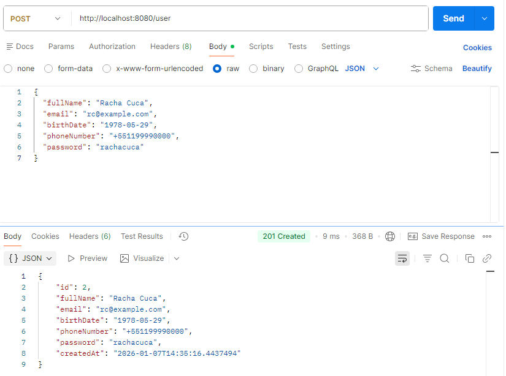
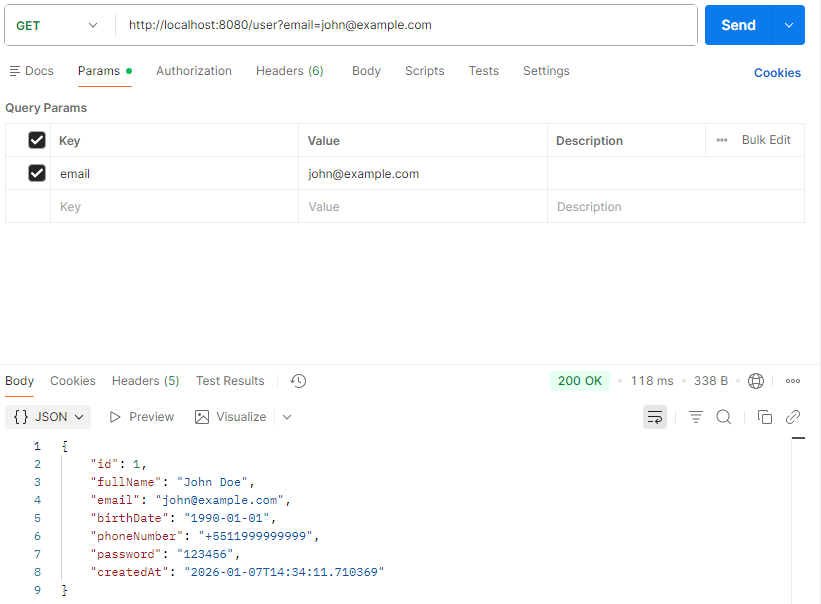
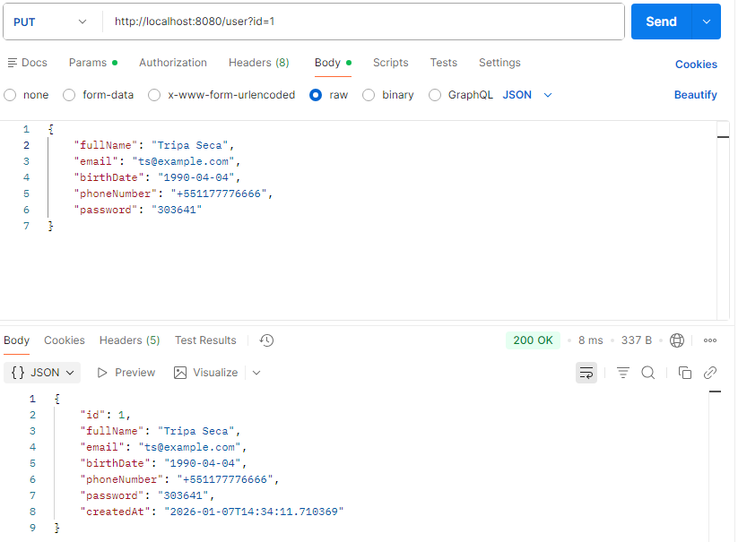
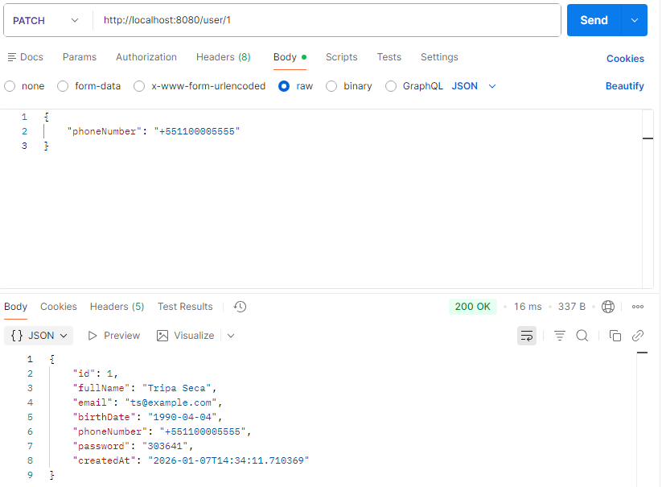
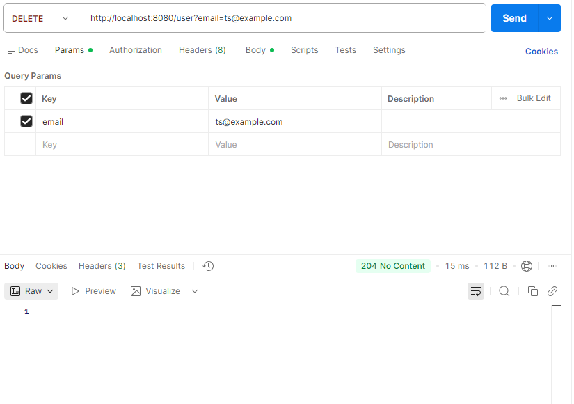
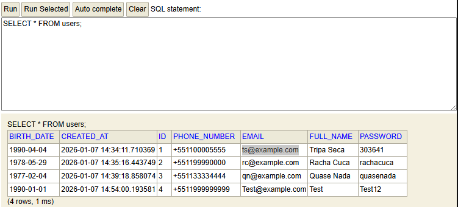

<h1 align="center">🧑‍💻 Userbase (EN)</h1>

<p align="center">
  🌎 <strong>Languages:</strong><br>
  <a href="README.md">🇧🇷 Portuguese</a> |
  <a href="README.en.md">🇺🇸 English</a>
</p>

A **user registration and management system** built with Java with Spring Boot, using H2 as an in-memory database. The project provides REST endpoints to **create, read, update (PUT/PATCH), and delete users**, with validation and exception handling.

Project developed as a practical exercise to learn Spring Boot, JPA, validation, and unit testing.

---

## 🎯 Why this project?

- Practice developing REST APIs with Spring Boot
- Learn to work with **full CRUD** (Create, Read, Update, Delete)
- Implement **PATCH** for partial updates
- Work with **data validation** and **global exception handling**
- Create unit and integration tests to ensure code quality

## 📂 Project Structure

```text
userbase/
├── src/main/java/com/pitergomes/userbase/
│   ├── business/
│   │   └── UserService.java              # Business logic and user manipulation
│   ├── controller/
│   │   └── UserController.java           # REST endpoints
│   ├── exception/
│   │   └── GlobalExceptionHandler.java   # Global error handling
│   ├── infrastructure/
│   │   ├── entities/
│   │   │   └── User.java                 # User entity mapped with JPA
│   │   └── repository/
│   │       └── UserRepository.java      # Persistence interface using JPA
│   └── UserbaseApplication.java         # Main Spring Boot class
├── src/test/java/com/pitergomes/userbase/
│   ├── business/
│   │   └── UserServiceTest.java          # Unit tests for the service
│   └── controller/
│       └── UserControllerTest.java       # Integration tests for the controller
├── src/main/resources/
│   └── application.properties            # Spring Boot and H2 configuration
├── pom.xml                                # Dependencies and Maven build
├── .gitignore                             # Git ignored files
└── README.md                              # This file
```
## 🛠️ Tools and Technologies

- **Java 21**
- **Spring Boot 3.5**
- **Spring Data JPA**
- **H2 Database** (in-memory)
- **Lombok** (boilerplate reduction)
- **Validation API** (jakarta.validation)
- **JUnit 5** + **Mockito** (unit and integration tests)
- **Maven** (dependency management and build)

## 🚀 How to run the project

### 1. Clone the repository:
```bash
git clone https://github.com/pitercoding/userbase.git
cd userbase
```
### 2. Build and run with Maven:
```bash
mvn clean install
mvn spring-boot:run
```

### 3. Access the API:

You can test the API using **Postman, Insomnia, or curl**.

- **POST /user** → create a user

```bash
curl -X POST http://localhost:8080/user \
-H "Content-Type: application/json" \
-d '{
  "fullName": "John Doe",
  "email": "john@example.com",
  "birthDate": "1990-01-01",
  "phoneNumber": "+5511999999999",
  "password": "123456"
}'
```

- **GET /user?email={email}** → get user by email

```bash
curl http://localhost:8080/user?email=john@example.com
```

- **PUT /user?id={id}** → fully update a user

```bash
curl -X PUT http://localhost:8080/user?id=1 \
-H "Content-Type: application/json" \
-d '{
  "fullName": "John Doe Updated",
  "email": "john@example.com",
  "birthDate": "1990-01-01",
  "phoneNumber": "+5511999999999",
  "password": "654321"
}'
```

- **PATCH /user/{id}** → update specific fields of a user

```bash
curl -X PATCH http://localhost:8080/user/1 \
-H "Content-Type: application/json" \
-d '{
  "phoneNumber": "+5511988888888"
}'
```

- **DELETE /user?email={email}** → remove a user

```bash
curl -X DELETE http://localhost:8080/user?email=john@example.com
```

### 4. Access H2 console (optional):
```yaml
URL: http://localhost:8080/h2-console
JDBC URL: jdbc:h2:mem:user
User: sa
Password: (leave blank)
```

## 📷 API Demonstration

### 🔹 Postman - Endpoints






### 🔹 H2 Console - Database


## 🎨 Project Features

- **Full CRUD** for users
- **Field validation**: name, email, password, phone
- **Partial updates** with PATCH using reflection
- **Global exception handling**: 400 (bad request/validation), 404 (not found)
- **Unit and integration tests** ensure reliability

## 🧪 Tests

The project includes unit tests (`UserServiceTest`) and integration tests (`UserControllerTest`) using **JUnit 5** and **Mockito**.

To run tests:
```bash
mvn test
```
## 📜 License

This project is licensed under the **MIT License** — feel free to use, study, and modify it.

## 🧑‍💻 Author

**Piter Gomes** — Computer Science Student (4th Semester) & Full-Stack Developer

📧 [Email](mailto:piterg.bio@gmail.com) | 💼 [LinkedIn](https://www.linkedin.com/in/piter-gomes-4a39281a1/) | 💻 [GitHub](https://github.com/pitercoding) | 🌐 [Portfolio](https://portfolio-pitergomes.vercel.app/)
